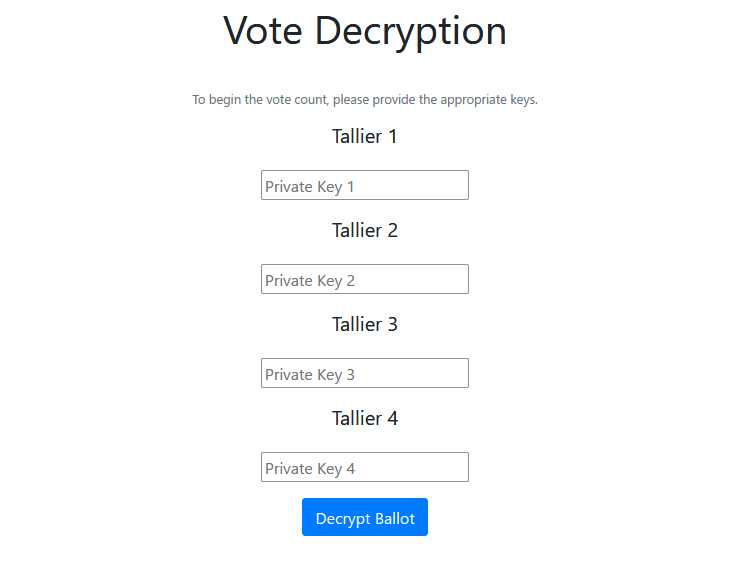

= SocratesBack

This is a front-end for the Vote Counting section of the Socrates Online Voting System.

Keys are received from the four Observants to decrypt the homomorphic database, then results are displayed.

